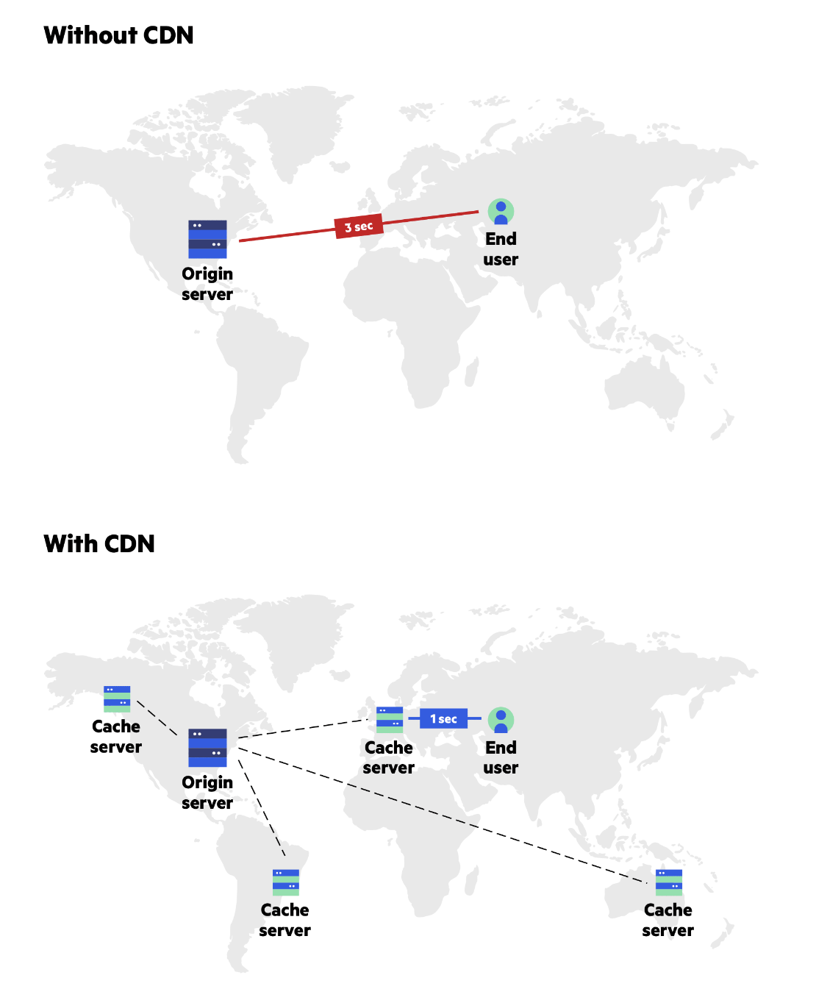
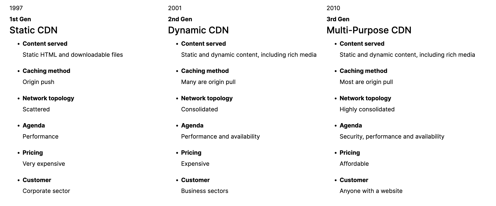
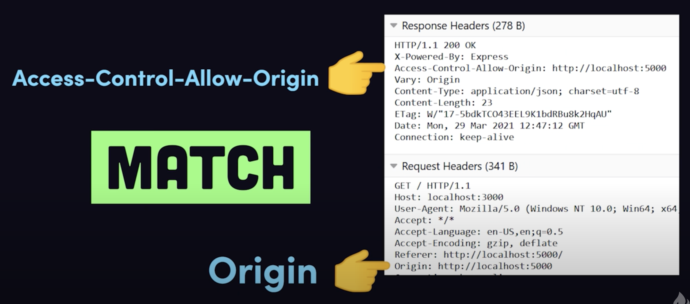
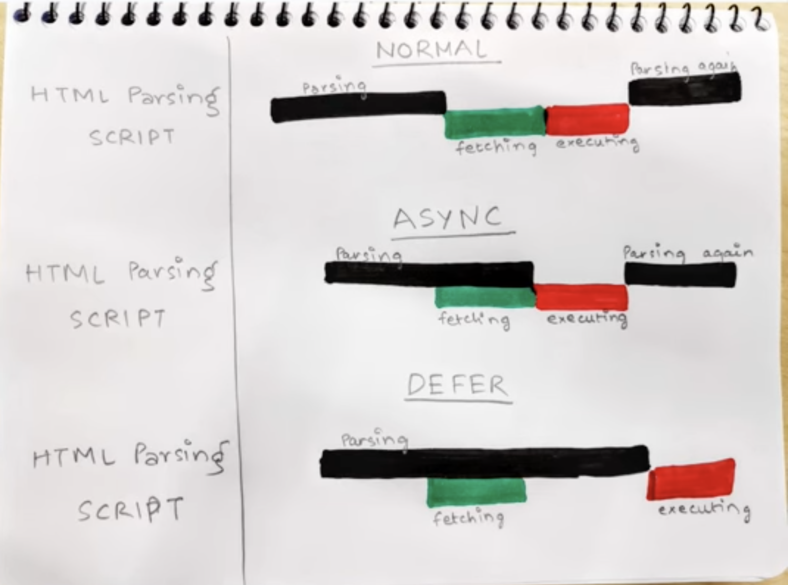

# Session - Inception

## What is Emmet?

[Emmet](<(https://emmet.io/)>) is a free add-on for your text editor that allows you to type shortcuts that are then expanded into full pieces of code.

- Is emmet only for HTML?  
  Emmet is mostly used for HTML, XML, and CSS, but it can also be used with programming languages
- Is emmet pre-installed in IDE?  
  In many popular IDE's it is pre-installed like VS code but for some we can install from [here](https://emmet.io/download/)
- [Learn more abbreviations](https://docs.emmet.io/abbreviations/)

---

## Difference between a Library and Framework?

Library takes minimum effort to put it into our code.  
React is a library , it can work in small portion of app as well.  
we don't require to change whole flow of app it can be applied easily.

---

## What is CDN? Why do we use it?

A content delivery network (CDN) is a group of geographically distributed servers that speed up the delivery of web content by bringing it closer to where users are.



- why do we use?  
  Caching/low latency, Security(DDOS attack) ,Load Balancing etc.

* is this widely used?  
  Yes, all the popular websites uses CDN

* from how long this concept is used?  
  evolution of CDN



---

## What is crossorigin in script tag?

The `crossorigin` attribute sets the mode of the request to an HTTP [CORS](https://www.youtube.com/watch?v=4KHiSt0oLJ0) Request.
The purpose of crossorigin attribute is used to share the resources from one domain to another domain. Basically, it is used to handle the CORS request. It is used to handle the CORS request that checks whether it is safe to allow for sharing the resources from other domains. [Video](https://www.youtube.com/watch?v=m6lsF8z0hKk)

if we set a crossorigin tag it will send a origin in request header and in response headers if we get Access-Control-Allow-Origin a same value than we will be able to access the other domain.



### _Syntax_

```sh
<script crossorigin="anonymous|use-credentials">
```

`anonymous` - A cross-origin request is performed. No credentials are sent (**user is making request anonymously**)  
`use-credentials` - A cross-origin request is performed. Credentials are sent (e.g. a cookie, a certificate, a HTTP Basic authentication)

- what if we send invalid keyword?  
  An invalid keyword and an empty string will be handled as the anonymous keyword

- what if we don't send crossorgin tag at all?  
  By default (that is, when the attribute is not specified), CORS is not used at all.
  #toResearchMore

Eample of React and React-dom CDN links:

```sh
<script crossorigin src="https://unpkg.com/react@18/umd/react.development.js"></script>

<script crossorigin src="https://unpkg.com/react-dom@18/umd/react-dom.development.js"></script>
```

---

## What is difference between react.development.js and react.production.js files via CDN?

Development is the stage of an application before it's made public while production is the term used for the same application when it's made public. Development build is several times (maybe 3-5x) slower than the production build.

---

## what are props in react?

Props are attributes of a tag + children

---

## what are head and body sections in HTML?

The head section contains meta information, the title of the page, internal style, external stylesheet link, internal javascript, external JavaScript file linking, etc.(not mandatory)

The body section contains everything that you see, read or hear on a browser all of it lies in the body of HTML, like text, images, GIFs, videos, audios, etc.

---

## where sould a script tag be placed in HTML?

`<script>` tags are loaded and executed by the browser as and when it encounters them. Most modern browsers have a number of multiple threads that render the HTML page at the same time, however, if all those threads are blocked waiting to load JavaScript assets, the page takes a whole lot longer to render.

That's the reason people usually place their `<script> `tags in the <body> at the bottom of the page, so that all the HTML of the page has been rendered, and the user can see something while the page loads any heavy JavaScript assets.

---

## Why is React known as React?

React is called "React" because of its core feature, which is its ability to "react" or respond dynamically to changes in data. React was originally created by Facebook in 2011 for use in their own web applications, and it was released as an open-source project in 2013.

---

## What is difference between React and ReactDOM?

`React`: React is a javascript library, designed for building better user interfaces.

`React-DOM`: React-DOM is a complimentary library to React which glues React to the browser DOM

`History:`
So React and React-DOM both are developed by the same team and up until React V0.14 React-DOM was shipped inside React package.

- Why did the React team decide to split React and React-DOM into two different libraries?  
  Because React-DOM binds the idea of React to a web browser. And ideally, React has nothing to do with a browser or web for that matter. That’s why we’re seeing tools and frameworks like React-Native, React-Three etc.

---

## What is `async and defer`?

`Async` - The async attribute is a `boolean attribute`. The script is downloaded in `parallel(in the background)` to parsing the page, and `executed as soon` as it is available (do not block HTML DOM construction during downloading process) and don’t wait for anything.

### _Syntax_

```sh
<script src="demo_async.js" async></script>
```

`Defer` - The defer attribute is a `boolean attribute`. The script is downloaded in `parallel(in the background)` to parsing the page, and `executed after the page` has finished parsing(when browser finished DOM construction). The `defer attribute` tells the browser `not to wait for the script`. Instead, the browser will continue to process the HTML, build DOM.

### _Syntax_

```sh
<script src="demo_defer.js" defer></script>
```


